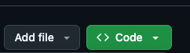
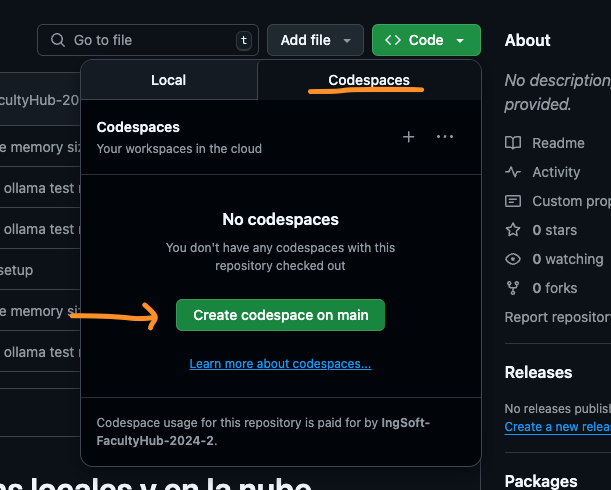

# Codespace para probar llms locales y en la nube

1- Para ejecutar un codespace usando este repositorio debe haber ingresado a GitHub con su cuenta Pro. Seleccione el botón Open Codespace

Seleccione el repositorio el Boton "Code""

Seleccione la solapa Codespaces y luego el botón verde que dice

 **"Create Codespace on Main"**.  

Una vez seleccionado, se abrirá una nueva pestaña del navegador y una version web de Visual Studio Code. El proceso demora varios minutos debido a que carga Ollama para correct Small Language models (SML) localmente.
Este Codespace está configurado con la VM máxima que permite la organización academica. Uds puede clonar este repositorio a su cuenta GitHub pro y cambiar a los valores ideales para ejecutar modelos locales mas grandes

[Configuración devcontainer](.devcontainer/devcontainer.json)

2- Una vez creado el Codespace, abra la terminal de vscode y ejecute el comnando **ollama --verision** para verificar que la instalación de ollama se haya realizado correctamente.**

3. Descargar el modelo llama3.2:1b u otro que figure en la lista de modelos <https://ollama.com/search>  con el comando **ollama pull llama3.2:1b**

4- Para verificar qué modelos están bien descargados, puede usar el comando **ollama list**

5. Una vez descargado el modelo, puede probarlo con el comando **ollama run llama3.2:1b**

6- Para probar en funcionamiento en la terminal ingregre el prompt **"cual es la capital de Uruguay?"**

7- Bajo la carpeta **notebooks** se encuentra el archivo **ollama.ipynb** que contiene ejemplos de uso de los modelos en Python con la API de OpenAI. Cuando comience a ejecutar la primera celda se le pedirá que elija el kernel o interprete de python que desea usar. Seleccione en la barra de comandos arriba el que esta en **.venev/bin.....**

